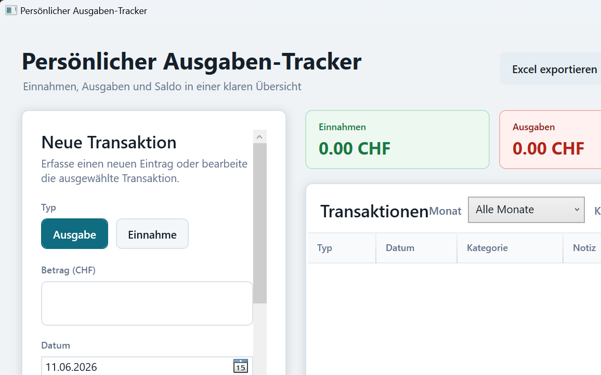
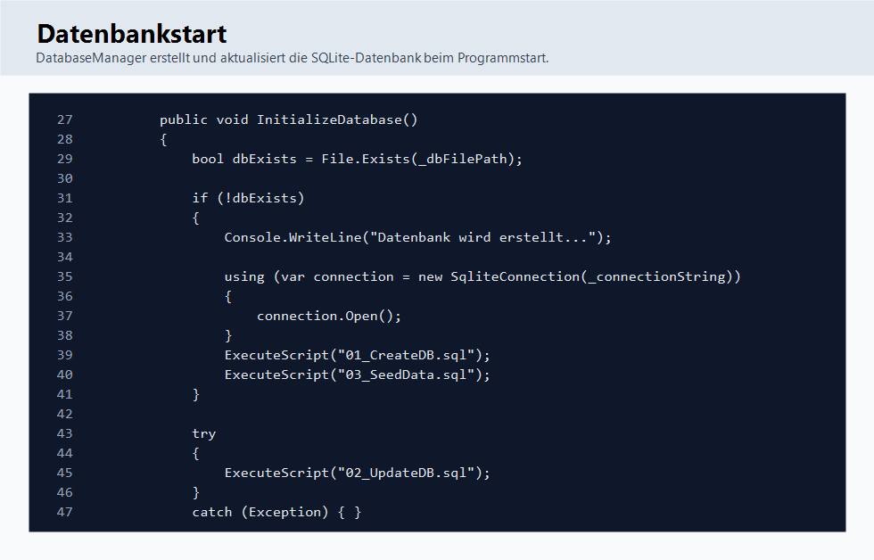
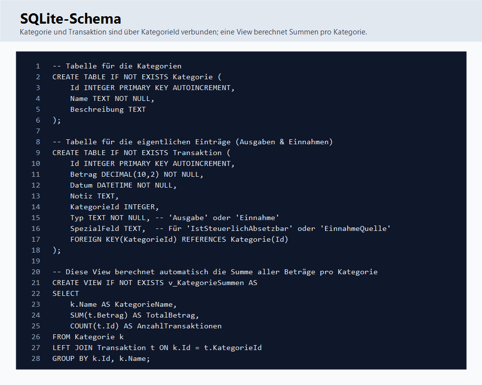
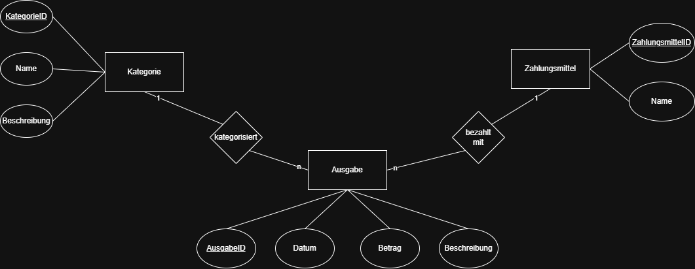
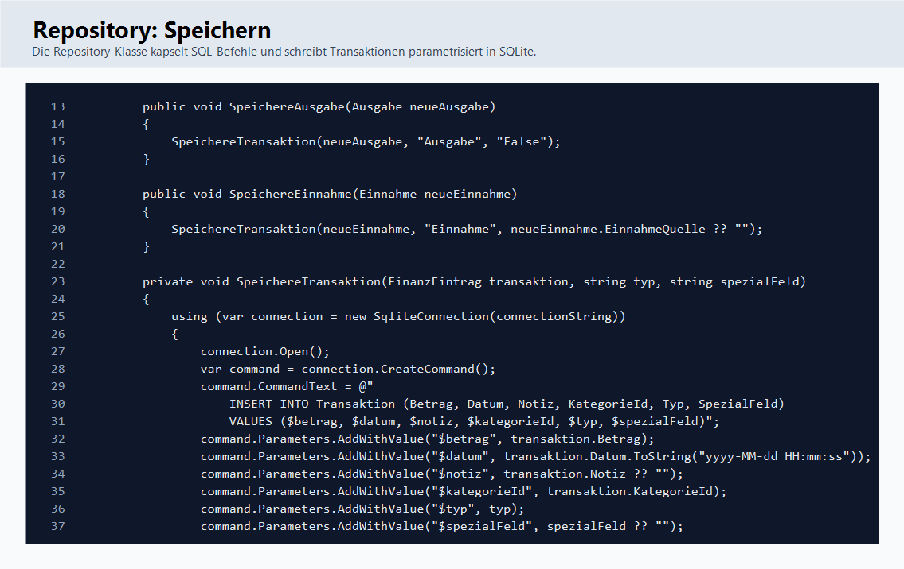
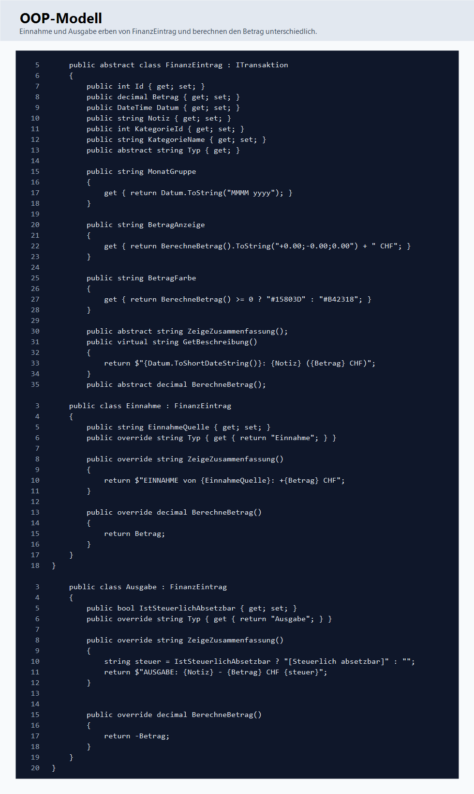
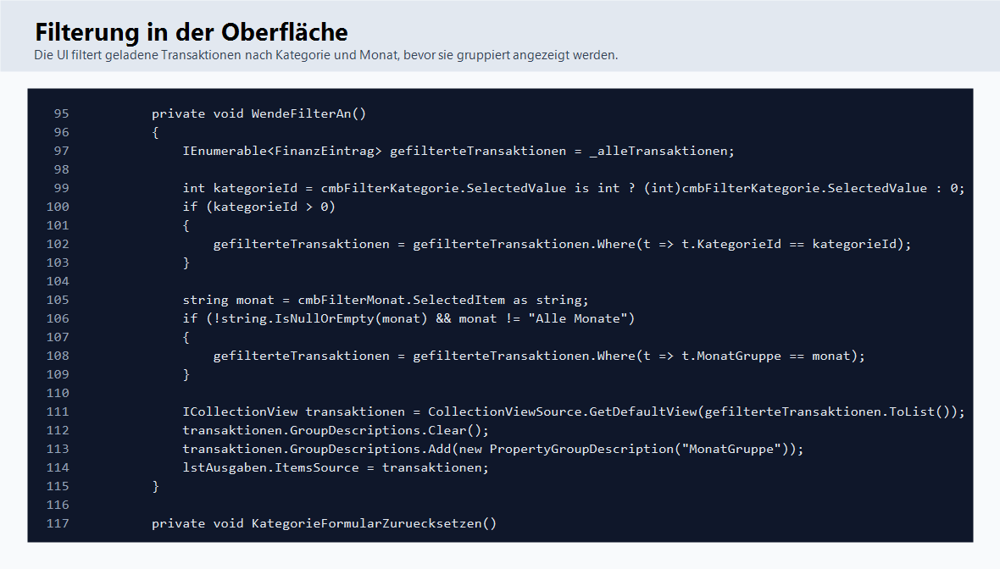
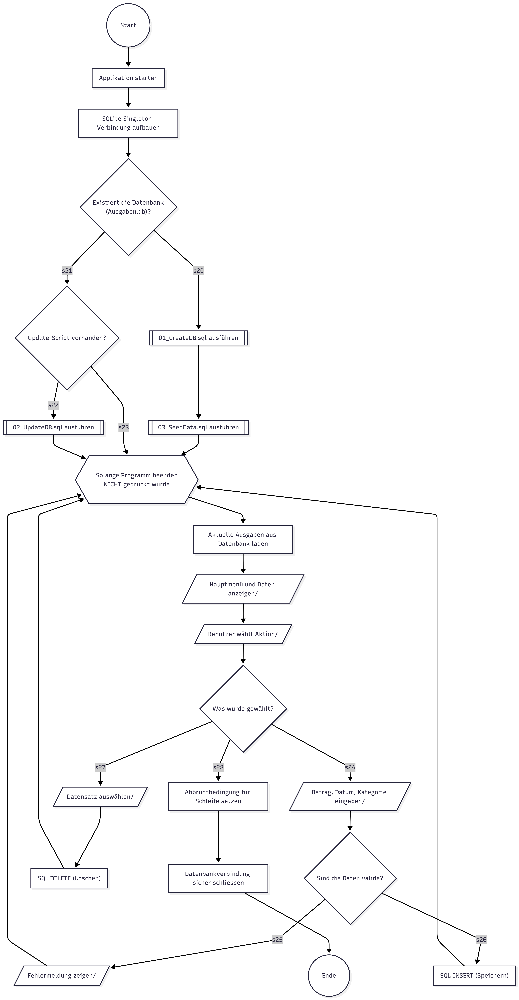

# Persönlicher Ausgaben-Tracker

Der **Persönliche Ausgaben-Tracker** ist eine Desktop-Anwendung in C# und WPF. Die Anwendung hilft dabei, Einnahmen und Ausgaben übersichtlich zu erfassen, zu kategorisieren, auszuwerten und dauerhaft in einer lokalen SQLite-Datenbank zu speichern.

Das Projekt wurde im Rahmen der Module 162, 164, 106, 319 und 320 umgesetzt. Es verbindet Datenmodellierung, Datenbankzugriff, objektorientierte Programmierung, Benutzeroberfläche, CRUD-Funktionen, Validierung und Unit-Tests in einer vollständigen Anwendung.

## 🎥 Projektpräsentation (Video)

<video src="https://github.com/bobiib/Pers-nlicher-Ausgaben-Tracker/releases/download/V1.0/Projektprasentation.mp4" controls="controls" style="max-width: 100%;"></video>

---



## Ziel der Anwendung

Viele private Ausgaben gehen im Alltag schnell unter. Diese Anwendung löst genau dieses Problem: Der Benutzer kann Einnahmen und Ausgaben eintragen, einer Kategorie zuordnen und später nachvollziehen, wofür Geld ausgegeben oder eingenommen wurde.

Die Anwendung zeigt nicht nur einzelne Einträge, sondern auch Gesamtwerte:

- gesamte Einnahmen
- gesamte Ausgaben
- aktueller Saldo
- Einnahmen, Ausgaben und Plus/Minus pro Monat
- gefilterte Ansicht nach Monat und Kategorie

Damit entsteht eine einfache persönliche Finanzübersicht ohne externe Cloud, ohne Benutzerkonto und ohne komplizierte Buchhaltungssoftware.

## Wichtigste Funktionen

- **Transaktionen erstellen:** Einnahmen und Ausgaben können mit Betrag, Datum, Notiz und Kategorie gespeichert werden.
- **Transaktionen anzeigen:** Alle gespeicherten Einträge werden in der Oberfläche angezeigt und nach Monat gruppiert.
- **Transaktionen bearbeiten:** Ein vorhandener Eintrag kann ausgewählt, geändert und erneut gespeichert werden.
- **Transaktionen löschen:** Nicht mehr benötigte Einträge können gelöscht werden.
- **Kategorien verwalten:** Kategorien können erstellt, bearbeitet und gelöscht werden.
- **Schutz vor falschem Löschen:** Kategorien, die noch von Transaktionen verwendet werden, können nicht gelöscht werden.
- **Monatsauswertung:** Neben jedem Monatsnamen werden Einnahmen, Ausgaben und Saldo dieses Monats angezeigt.
- **Filterung:** Die Liste kann nach Monat und Kategorie gefiltert werden.
- **Beispieldaten:** Über eine Schaltfläche können Beispieltransaktionen eingefügt werden.
- **Excel-Export:** Die Finanzübersicht kann als Excel-kompatible Datei exportiert werden.
- **SQLite-Persistenz:** Alle Daten werden dauerhaft in `Ausgaben.db` gespeichert.
- **Automatische Datenbankerstellung:** Beim ersten Start erstellt die App die Datenbank automatisch.
- **Datenbank-Updates:** Ein Update-Script kann beim Start automatisch ausgeführt werden.
- **Fehlerbehandlung:** Ungültige Eingaben und Datenbankfehler werden abgefangen und verständlich angezeigt.
- **Unit-Tests:** Datenbank, Singleton, CRUD, Kategorien, Beispieldaten und Saldo werden getestet.

## Projektstruktur

```text
Pers-nlicher-Ausgaben-Tracker/
├── Datenbankstruktur/
│   ├── ER-Diagramm_PersoenlicherAusgabenTracker.drawio.png
│   └── Relationales Datenbankmodell.png
├── docs/
│   └── images/
│       ├── app-uebersicht.png
│       ├── code-database-start.png
│       ├── code-filtering.png
│       ├── code-oop-model.png
│       ├── code-repository-save.png
│       └── code-sql-schema.png
├── Planung/
│   └── Projektplan_AusgabenTracker.md
├── Softwaredesign/
│   ├── Programmablaufplan.png.png
│   └── UML Klassendiagramm.png
├── SQL_Scripts/
│   ├── 01_CreateDB.sql
│   ├── 02_UpdateDB.sql
│   └── 03_SeedData.sql
└── src/
    ├── Ausgabentracker/
    │   ├── Database/
    │   ├── Models/
    │   ├── Repositories/
    │   ├── MainWindow.xaml
    │   └── MainWindow.xaml.cs
    └── UnitTestProject1/
```

## Bedienung

Beim Start öffnet sich das Hauptfenster. Links befindet sich der Eingabebereich, rechts die Übersicht der gespeicherten Transaktionen.

Der typische Ablauf ist:

1. Betrag eingeben.
2. Datum auswählen.
3. Kategorie auswählen.
4. Notiz eintragen.
5. Einnahme oder Ausgabe auswählen.
6. Speichern.

Danach wird die Transaktion in der Liste angezeigt. Die Summen oben werden automatisch aktualisiert.

Wenn ein Eintrag bearbeitet werden soll, wird er in der Liste ausgewählt. Die Daten erscheinen wieder im Formular und können angepasst werden. Beim erneuten Speichern wird nicht ein neuer Eintrag erstellt, sondern der vorhandene Eintrag in der Datenbank aktualisiert.

## Wie die Anwendung intern funktioniert

Die Anwendung ist in klare Bereiche aufgeteilt:

- **WPF-Oberfläche:** `MainWindow.xaml` definiert das Aussehen der Anwendung.
- **Code-Behind:** `MainWindow.xaml.cs` reagiert auf Klicks, liest Eingaben aus und aktualisiert die Oberfläche.
- **Model-Klassen:** Die Klassen in `Models` beschreiben Einnahmen, Ausgaben und Kategorien.
- **Repository:** `AusgabenRepository` enthält die SQL-Befehle für Speichern, Laden, Bearbeiten und Löschen.
- **DatabaseManager:** Erstellt und aktualisiert die SQLite-Datenbank.
- **SQL-Scripts:** Definieren Tabellen, Updates und Startdaten.
- **Unit-Tests:** Prüfen zentrale Funktionen automatisiert.

Ein vereinfachter Ablauf beim Speichern sieht so aus:

```text
Benutzer klickt "Speichern"
        ↓
MainWindow.xaml.cs liest Betrag, Datum, Kategorie und Typ
        ↓
Es wird ein Einnahme- oder Ausgabe-Objekt erstellt
        ↓
AusgabenRepository schreibt das Objekt mit SQL in SQLite
        ↓
RefreshAll() lädt alle Daten neu
        ↓
Liste, Filter und Summen werden aktualisiert
```

## Datenbank und Persistenz

Die Daten werden lokal in einer SQLite-Datei gespeichert. Diese Datei heißt:

```text
Ausgaben.db
```

SQLite ist hier sinnvoll, weil keine separate Datenbankinstallation nötig ist. Die Datenbank ist eine normale Datei im Projekt bzw. im Ausführungsverzeichnis der Anwendung.

Beim Start ruft die Anwendung den `DatabaseManager` auf. Dieser prüft:

1. Existiert die Datenbankdatei bereits?
2. Falls nein: `01_CreateDB.sql` ausführen.
3. Danach: `03_SeedData.sql` für Standarddaten ausführen.
4. Anschließend: `02_UpdateDB.sql` ausführen, falls spätere Änderungen notwendig sind.



Einfach erklärt: Die Anwendung bereitet ihre Datenbank selbst vor. Der Benutzer muss keine Tabellen manuell anlegen.

## Datenmodell

Die Datenbank besteht hauptsächlich aus zwei Tabellen:

- `Kategorie`
- `Transaktion`

Eine Kategorie kann mehrere Transaktionen besitzen. Jede Transaktion kann einer Kategorie zugeordnet werden. Die folgenden Diagramme wurden auf den aktuellen Projektstand angepasst und zeigen die Tabellen, Schlüssel, Beziehungen und die View `v_KategorieSummen`.



Das aktuelle relationale Modell sieht so aus:


Das aktuelle ER-Modell zeigt dieselbe Idee auf konzeptioneller Ebene:



## Repository: Daten speichern und laden

Der direkte Datenbankzugriff ist bewusst in `AusgabenRepository` ausgelagert. Dadurch muss die Oberfläche keine SQL-Befehle kennen.

Wenn eine Ausgabe oder Einnahme gespeichert wird, erstellt das Repository einen SQL-Befehl mit Parametern. Parameter sind wichtig, weil Werte sauber an SQLite übergeben werden und nicht direkt als Text in den SQL-Befehl geklebt werden.



Einfach erklärt:

- Die Oberfläche sammelt die Benutzereingaben.
- Das Repository bekommt ein Objekt.
- Das Repository öffnet die SQLite-Verbindung.
- Der SQL-Befehl wird ausgeführt.
- Die Verbindung wird wieder geschlossen.

Das gleiche Prinzip wird für Lesen, Bearbeiten und Löschen verwendet.

## Objektorientierte Programmierung

Das Projekt verwendet OOP nicht nur formal, sondern sinnvoll für die Fachlogik.

Die abstrakte Klasse `FinanzEintrag` beschreibt gemeinsame Eigenschaften:

- `Id`
- `Betrag`
- `Datum`
- `Notiz`
- `KategorieId`
- `KategorieName`

Davon erben zwei konkrete Klassen:

- `Einnahme`
- `Ausgabe`

Der wichtige Unterschied liegt in `BerechneBetrag()`:

- Eine Einnahme gibt einen positiven Betrag zurück.
- Eine Ausgabe gibt einen negativen Betrag zurück.



Einfach erklärt: Beide Klassen sind Finanz-Einträge, aber sie verhalten sich beim Rechnen unterschiedlich. Genau dafür ist Vererbung und Polymorphismus geeignet.

## Oberfläche, Filter und Monatsgruppen

Die Oberfläche lädt nicht bei jedem Filter direkt aus der Datenbank neu. Stattdessen werden alle Transaktionen einmal geladen und anschließend in der Anwendung gefiltert.

Der Filter funktioniert über:

- Kategorie
- Monat

Danach wird die gefilterte Liste nach `MonatGruppe` gruppiert.



Einfach erklärt:

- `_alleTransaktionen` enthält alle Daten aus der Datenbank.
- Wenn eine Kategorie gewählt ist, bleiben nur passende Einträge übrig.
- Wenn ein Monat gewählt ist, bleiben nur Einträge aus diesem Monat übrig.
- Die fertige Liste wird gruppiert angezeigt.

## Monatsauswertung

Jede Transaktion hat über `MonatGruppe` einen Monatsnamen, zum Beispiel:

```text
Juni 2026
```

Die Oberfläche gruppiert Einträge nach diesem Wert. Zusätzlich berechnet ein Converter für jede Monatsgruppe:

- Summe der Einnahmen
- Summe der Ausgaben
- Saldo des Monats

Dadurch steht direkt neben dem Monatsnamen, ob der Monat insgesamt positiv oder negativ war.

## Kategorien

Kategorien helfen, Transaktionen besser zu ordnen. Beispiele:

- Lebensmittel
- Wohnen
- Freizeit
- Gehalt

Die Kategorien werden in einer eigenen Tabelle gespeichert. Eine Transaktion verweist über `KategorieId` auf eine Kategorie.

Beim Löschen einer Kategorie prüft die Anwendung zuerst, ob noch Transaktionen diese Kategorie verwenden. Falls ja, wird das Löschen verhindert. Das schützt die Daten vor ungültigen Zuständen.

## Beispieldaten

Die Anwendung besitzt eine Schaltfläche zum Einfügen von Beispieldaten. Dabei werden typische Einträge eingefügt, zum Beispiel Monatslohn, Miete oder Einkauf.

Die Funktion prüft vorher, ob diese Beispieldaten bereits vorhanden sind. Dadurch werden sie nicht mehrfach eingefügt, wenn der Benutzer die Schaltfläche mehrmals klickt.

## Excel-Export

Die Anwendung kann die Transaktionen als Excel-kompatible Datei exportieren. Dabei wird eine XML-basierte Spreadsheet-Datei erzeugt, die von Excel geöffnet werden kann.

Der Export ist nützlich, wenn Daten außerhalb der Anwendung weiterverarbeitet oder abgegeben werden sollen.

## Softwaredesign

Das UML-Klassendiagramm dokumentiert die wichtigsten aktuellen Klassen und Beziehungen der Anwendung. Es zeigt unter anderem `MainWindow`, `AusgabenRepository`, `DatabaseManager`, die OOP-Modelle, das Interface und den Converter für die Monatsauswertung:


Der Programmablaufplan zeigt den groben Ablauf der Anwendung:



## Qualitätssicherung

Das Projekt enthält Unit-Tests mit MSTest. Die Tests prüfen unter anderem:

- ob die Datenbank erstellt wird
- ob das Singleton Pattern funktioniert
- ob Ausgaben gespeichert werden
- ob Einnahmen gespeichert werden
- ob Einträge gelöscht werden
- ob Einträge bearbeitet werden
- ob der Saldo korrekt berechnet wird
- ob Kategorie-CRUD funktioniert
- ob Beispieldaten eingefügt werden

Aktueller lokaler Teststand:

```text
Gesamtzahl Tests: 9
Bestanden: 9
Fehlgeschlagen: 0
```

## Technologien

- **Programmiersprache:** C#
- **Framework:** .NET Framework 4.8
- **Oberfläche:** WPF
- **Datenbank:** SQLite
- **Datenbankzugriff:** Microsoft.Data.Sqlite
- **Architektur:** Model-Klassen, Repository, Singleton DatabaseManager
- **Tests:** MSTest
- **Versionsverwaltung:** Git und GitHub
- **Dokumentation:** Markdown, Diagramme und Screenshots

## Projektanforderungen und Umsetzung

| Anforderung | Umsetzung |
| --- | --- |
| C#-Anwendung | WPF-Anwendung unter `src/Ausgabentracker` |
| SQLite-Datenbank | Lokale Datei `Ausgaben.db` |
| Datenbank automatisch erstellen | `DatabaseManager` führt `01_CreateDB.sql` aus |
| Datenbank-Update | `02_UpdateDB.sql` wird beim Start berücksichtigt |
| Beispieldaten | `03_SeedData.sql` und UI-Funktion für Beispieltransaktionen |
| CRUD | Transaktionen und Kategorien können erstellt, gelesen, bearbeitet und gelöscht werden |
| Singleton Pattern | `DatabaseManager.Instance` |
| OOP | `FinanzEintrag`, `Einnahme`, `Ausgabe`, `Kategorie` |
| Vererbung | `Einnahme` und `Ausgabe` erben von `FinanzEintrag` |
| Polymorphismus | `BerechneBetrag()` wird unterschiedlich überschrieben |
| Abstraktion | `FinanzEintrag` ist abstrakt |
| Interface | `ITransaktion` definiert Methoden für Transaktionen |
| Validierung | Eingaben werden vor dem Speichern geprüft |
| Fehlerbehandlung | Fehler werden über Meldungen angezeigt |
| Unit-Tests | MSTest-Projekt unter `src/UnitTestProject1` |
| ER-Modell | In `Datenbankstruktur` abgelegt |
| Relationales Modell | In `Datenbankstruktur` abgelegt |
| UML-Klassendiagramm | In `Softwaredesign` abgelegt |
| Programmablaufplan | In `Softwaredesign` abgelegt |
| Projektplan | In `Planung/Projektplan_AusgabenTracker.md` |

## Starten des Projekts

### 🚀 Direktstart (Ohne Compilierung & NuGet-Wiederherstellung)
Wer die Anwendung einfach nur ausführen möchte, ohne Visual Studio zu installieren:
1. Laden Sie die Datei `Ausgabentracker_v1.0.zip` aus den **Releases** des GitHub-Repositories herunter.
2. Entpacken Sie den ZIP-Ordner vollständig an einen beliebigen Ort auf Ihrem PC.
3. Starten Sie die Anwendung per Doppelklick auf die Datei **`Ausgabentracker.exe`**.

### 🛠️ Entwickler-Setup (Kompilierung aus Quellcode)
Voraussetzungen:

- Windows
- Visual Studio 2022
- .NET Framework 4.8 Developer Pack
- NuGet-Paketwiederherstellung aktiviert

Empfohlene Schritte:

1. Repository klonen.
2. `src/Ausgabentracker/Ausgabentracker.sln` in Visual Studio öffnen.
3. NuGet-Pakete wiederherstellen.
4. Plattform auf `x64` setzen.
5. Projekt starten.

Für Tests:

```powershell
vstest.console.exe src\UnitTestProject1\bin\x64\Debug\UnitTestProject1.dll /Platform:x64
```

## Projekt-Team

- **Boris:** Softwareentwicklung, OOP-Architektur, Benutzeroberfläche
- **Dmytro:** Datenbankmodellierung, SQL-Scripts, Persistenz
- **Fabio:** Qualitätssicherung, Unit-Tests, Dokumentation, Git-Verwaltung

## Fazit

Der Persönliche Ausgaben-Tracker erfüllt die zentralen Projektanforderungen: Die Anwendung besitzt eine benutzerfreundliche Oberfläche, speichert Daten dauerhaft in SQLite, verwendet objektorientierte Konzepte, bietet CRUD-Funktionen, enthält Datenbank-Scripts, dokumentiert Daten- und Softwaredesign und wird durch Unit-Tests abgesichert.

Die Anwendung ist damit nicht nur ein Prototyp, sondern ein vollständiges kleines Desktop-Projekt mit nachvollziehbarer Architektur und dokumentierter Umsetzung.
